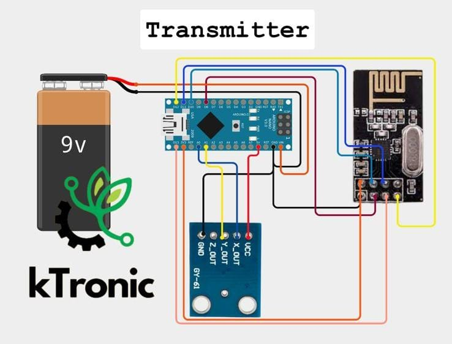
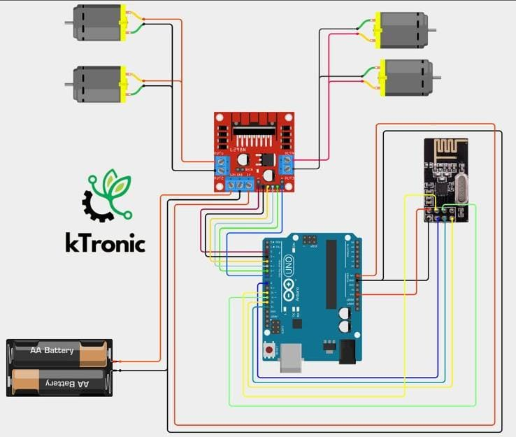

# Gesture-Drive Vehicle (Sensor Fusion & Telemetry) 🖐️🏎️

### Overview

A wireless, gesture-controlled robotic vehicle platform. This system captures a user's hand kinematics in real-time using a 6-axis accelerometer and gyroscope, processes the spatial data, and transmits motion commands wirelessly to control a mobile drive system.

### 🔬 Applications in Research & Lab Automation

This project highlights practical expertise in **Sensor Fusion**, **I2C/SPI Communication**, and **Hardware State Mapping**. Reading raw data from physical sensors, filtering out mechanical noise, and converting that data into actionable control logic is highly relevant to:

* Interfacing with scientific instrumentation (e.g., positioning stages, piezoelectric actuators).
* Processing raw analog/digital data streams from lab environments.
* Designing remote telemetry systems for isolated experimental setups.

---

### 🏗️ System Architecture & Workflow

The system is split into a wearable transmitter and a mobile receiver, communicating over a 2.4GHz RF link.

1. **Transmitter Node (The Glove):**
* **Hardware:** Arduino Nano.
* **Sensor Interface:** An MPU-6050 (Accelerometer/Gyroscope) captures pitch and roll dynamics over the I2C bus.
* **Data Processing:** The raw 16-bit sensor values (-16,000 to +16,000) are programmatically mapped to a 10-bit scale (0-1023) for transmission.
* **Telemetry:** Data packets are pushed via SPI to an NRF24L01 radio transceiver.

2. **Receiver Node (The Vehicle):**
* **Hardware:** Arduino Uno.
* **Telemetry Reception:** An NRF24L01 module receives the incoming coordinate packets.
* **Kinematic Mapping:** A custom "deadzone" algorithm (values between 350 and 700) is applied to ensure the vehicle remains perfectly stationary when the transmitter is level, filtering out minor hand tremors.
* **Actuation:** Processed commands are mapped to an L298N motor driver via PWM, enabling proportional forward/backward and differential steering control.

---

### 📂 Repository Structure

* `Transmitter/glove_tx.ino`: The C++ logic for I2C sensor reading, data mapping, and RF transmission.
* `Receiver/car_rx.ino`: The C++ logic for RF reception, deadzone thresholding, and PWM motor control.

---

### 🛠️ Hardware Requirements

**Transmitter:**

* 1x Arduino Nano
* 1x MPU-6050 (6-axis Accelerometer/Gyro)
* 1x NRF24L01 Wireless Transceiver Module

**Receiver:**

* 1x Arduino Uno
* 1x NRF24L01 Wireless Transceiver Module
* 1x L298N Motor Driver
* 2x to 4x DC Gear Motors
